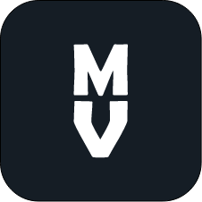

# MoVee-Android
🎞️ Movie info. App using TheMovieDB API.Here i demonstrate the use of Modern Android development tools - (Kotlin, Architecture Components, MVVM, Material Components etc.)
## Built With 🛠
* [Kotlin] - First class and official programming language for Android development.
* [ViewModel] - Stores UI-related data that isn't destroyed on UI changes.
* [Retrofit] - A type-safe HTTP client for Android and Java.
* [GSON] - A Java serialization/deserialization library to convert Java Objects into JSON and back.
* [GSON Converter] - A Converter which uses Gson for serialization to and from JSON.
* [Glide] - An image loading and caching library for Android focused on smooth scrolling.
* [Material Components for Android] - Modular and customizable Material Design UI components for Android.
* [Android-Image-Slider] - An amazing image slider for the Android.
* [ReadMoreTextView] - A Custom TextView with trim text.
## App Icon 📱

[Kotlin]: https://kotlinlang.org/
[ViewModel]: https://developer.android.com/topic/libraries/architecture/viewmodel
[Retrofit]: https://square.github.io/retrofit/
[GSON]: https://github.com/google/gson
[GSON Converter]: https://github.com/square/retrofit/tree/master/retrofit-converters/gson
[Glide]: https://github.com/bumptech/glide
[Material Components for Android]: https://github.com/material-components/material-components-android
[Android-Image-Slider]: https://github.com/smarteist/Android-Image-Slider
[ReadMoreTextView]: https://github.com/bravoborja/ReadMoreTextView
